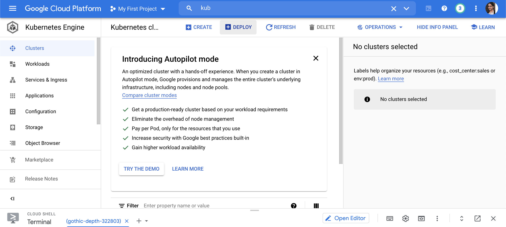
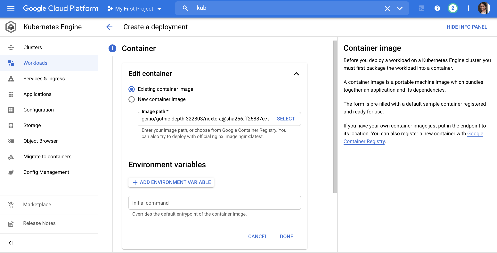
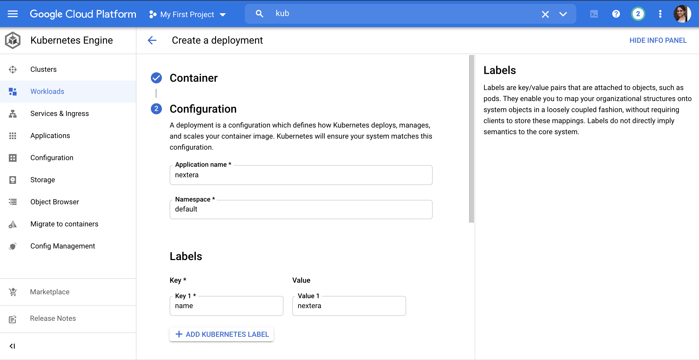
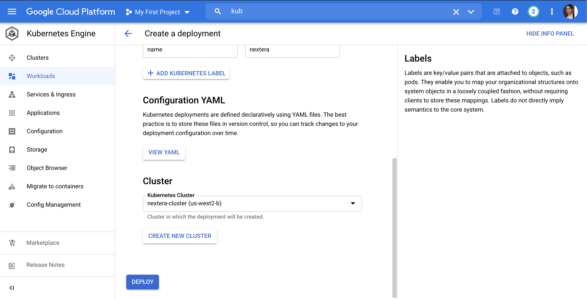
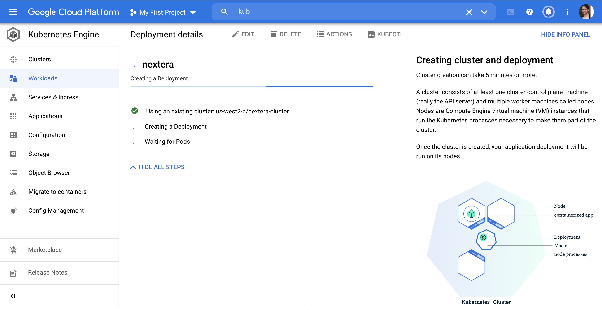
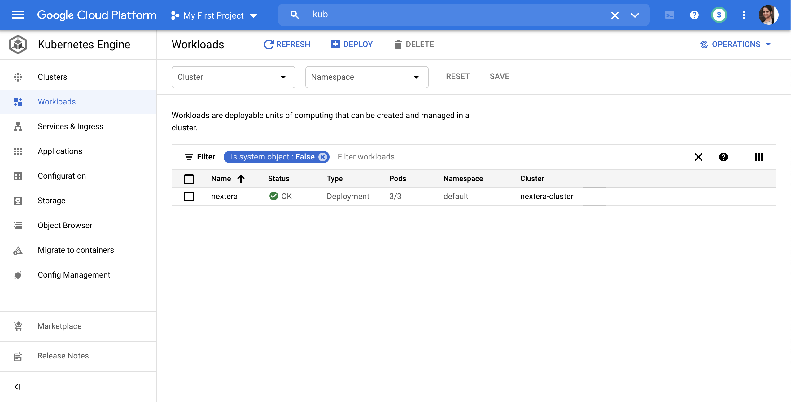
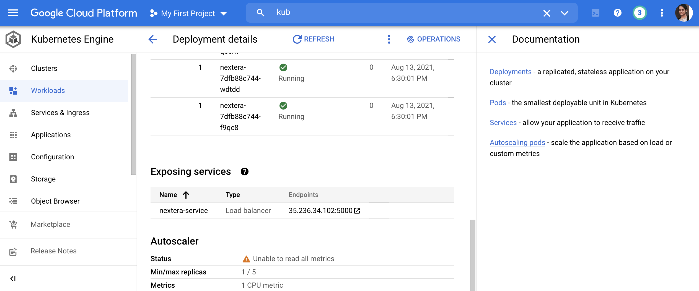
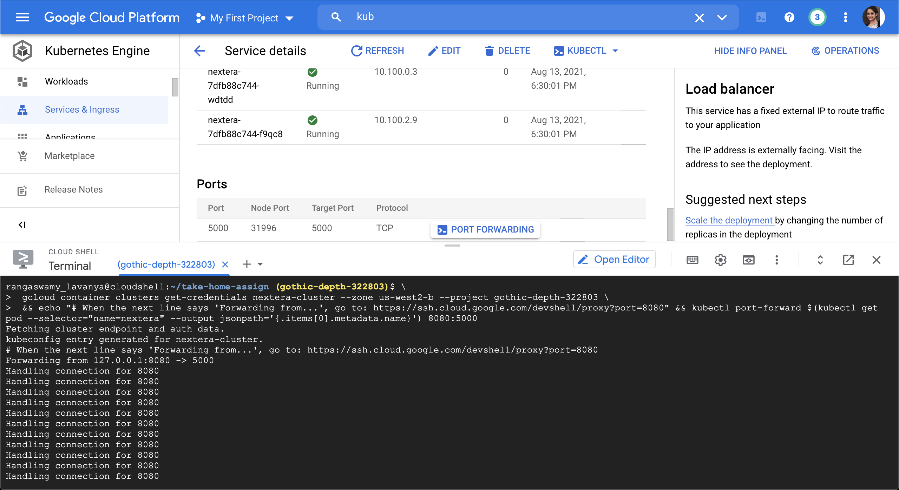

# Take-home-assignment 
A simple Flask-Kubernetes-Docker web application that allows the user to upload a .CSV file. On successful file upload, the application should perform the following validations:
Checks whether the uploaded is a .CSV and not any other format.
Check whether the .CSV file has exactly 10 rows and 3 columns.
Checks whether the data is present in each cell (.CSV file is "complete"). A "complete" sample test.csv is available in this repository for testing purposes.
<br>

# Contents
* [Features](#features)
* [Technologies & Stack](#techstack)
* [Set-up & Installation](#installation)
* [Google Cloud Deployment Steps](#deployment)


## <a name="features"></a> Features

Homepage - page where you can upload file
<br>


Validate_file - throws response message after validating the file
<br>


## <a name="techstack"></a> Technologies and Stack
**Backend:**
Python, Flask <br>
**Frontend:**
HTML, Jinja, CSS <br>

## <a name="installation"></a> Code Set-up & Installation
Install a code editor such as [VS code](https://code.visualstudio.com/download) or [Sublime Text](https://www.sublimetext.com/).<br>
Install [Python3](https://www.python.org/downloads/mac-osx/)<br>
Install [pip](https://pip.pypa.io/en/stable/installing/), the package installer for Python <br>

Clone or fork repository:
```
$ git clone https://github.com/rlavanya9/take-home-assign.git
```
Create and activate a virtual environment inside the directory:
```
$ virtualenv myproject
$ source myproject/bin/activate
```
Install dependencies:
```
$ pip3 install -r requirements.txt
```
In server.py, get the file uploaded and do all the file validations
Run the app from the command line:
```
$ python3 server.py
```

## <a name="deployment"></a> Google Cloud Deployment Steps
1. Set the PROJECT_ID env
```
rangaswamy_lavanya@cloudshell:~ (gothic-depth-322803)$ export PROJECT_ID="$(gcloud config get-value project -q)"
Your active configuration is: [cloudshell-20755]
```
2. Checkout git repo
```
rangaswamy_lavanya@cloudshell:~ (gothic-depth-322803)$ rangaswamy_lavanya@cloudshell:~ (gothic-depth-322803)$ git clone https://github.com/rlavanya9/take-home-assign.git
Cloning into 'take-home-assign'...
remote: Enumerating objects: 30, done.
remote: Counting objects: 100% (30/30), done.
remote: Compressing objects: 100% (20/20), done.
remote: Total 30 (delta 7), reused 28 (delta 5), pack-reused 0
Unpacking objects: 100% (30/30), done.
```
3. Authenticate gcloud CLI to access Google Container Registry
```
rangaswamy_lavanya@cloudshell:~ (gothic-depth-322803)$ gcloud auth configure-docker
```
4. Build docker image 
```
rangaswamy_lavanya@cloudshell:~ (gothic-depth-322803)$ ls -lr
total 8
drwxr-xr-x 5 rangaswamy_lavanya rangaswamy_lavanya 4096 Aug 14 01:23 take-home-assign
-rw-r--r-- 1 rangaswamy_lavanya rangaswamy_lavanya  913 Aug 14 01:15 README-cloudshell.txt
rangaswamy_lavanya@cloudshell:~ (gothic-depth-322803)$ cd take-home-assign/
rangaswamy_lavanya@cloudshell:~/take-home-assign (gothic-depth-322803)$ docker build -t gcr.io/${PROJECT_ID}/nextera:v1 .
Sending build context to Docker daemon  123.9kB
Step 1/7 : FROM python:3.8-slim-buster
3.8-slim-buster: Pulling from library/python
33847f680f63: Pull complete
e8124950597e: Pull complete
cc636c24d49d: Pull complete
1fbf3ac5d4b6: Pull complete
9c75408cb807: Pull complete
Digest: sha256:2e3ccafe2607a9bfee9f838727bc2270acb40245acdd7c57d48c49d52ccf84f4
Status: Downloaded newer image for python:3.8-slim-buster
 ---> 9f8ae807230c
Step 2/7 : WORKDIR /app
 ---> Running in 4777568a7182
Removing intermediate container 4777568a7182
 ---> 42e7762770e7
Step 3/7 : COPY requirements.txt requirements.txt
 ---> 0c13850da28f
Step 4/7 : RUN pip3 install -r requirements.txt
 ---> Running in 589ca9082e28
Collecting Flask==1.1.2
  Downloading Flask-1.1.2-py2.py3-none-any.whl (94 kB)
Collecting Jinja2==2.11.2
  Downloading Jinja2-2.11.2-py2.py3-none-any.whl (125 kB)
Collecting MarkupSafe==1.1.1
  Downloading MarkupSafe-1.1.1-cp38-cp38-manylinux2010_x86_64.whl (32 kB)
Collecting Werkzeug==1.0.1
  Downloading Werkzeug-1.0.1-py2.py3-none-any.whl (298 kB)
Collecting click==8.0.1
  Downloading click-8.0.1-py3-none-any.whl (97 kB)
Collecting itsdangerous>=0.24
  Downloading itsdangerous-2.0.1-py3-none-any.whl (18 kB)
Installing collected packages: MarkupSafe, Werkzeug, Jinja2, itsdangerous, click, Flask
Successfully installed Flask-1.1.2 Jinja2-2.11.2 MarkupSafe-1.1.1 Werkzeug-1.0.1 click-8.0.1 itsdangerous-2.0.1
WARNING: Running pip as the 'root' user can result in broken permissions and conflicting behaviour with the system package manager. It is recommended to use a virtual environment instead: https://pip.pypa.io/warnings/venv
Removing intermediate container 589ca9082e28
 ---> b61d713b2d43
Step 5/7 : COPY . .
 ---> 10bc5e0b2eda
Step 6/7 : EXPOSE 5000
 ---> Running in 045bc7962ae8
Removing intermediate container 045bc7962ae8
 ---> 798b8de49c07
Step 7/7 : CMD [ "python3", "server.py", "--host", "0.0.0.0", "--port", "5000"]
 ---> Running in c41362cf1fe1
Removing intermediate container c41362cf1fe1
 ---> 7c911cd61b51
Successfully built 7c911cd61b51
Successfully tagged gcr.io/gothic-depth-322803/nextera:v1
```
5. List the created docker image
```
rangaswamy_lavanya@cloudshell:~/take-home-assign (gothic-depth-322803)$ docker image ls
REPOSITORY                           TAG               IMAGE ID       CREATED          SIZE
gcr.io/gothic-depth-322803/nextera   v1                7c911cd61b51   49 seconds ago   125MB
python                               3.8-slim-buster   9f8ae807230c   28 hours ago     114MB
```
6. Push docker image
```
rangaswamy_lavanya@cloudshell:~ (gothic-depth-322803)$ rangaswamy_lavanya@cloudshell:~/take-home-assign (gothic-depth-322803)$ docker push gcr.io/${PROJECT_ID}/nextera:v1
The push refers to repository [gcr.io/gothic-depth-322803/nextera]
91e6525fdab9: Pushed
00c797aa6613: Pushed
523e75e2e262: Pushed
907a6db28d1f: Pushed
f01b1d7b2bee: Layer already exists
3d87bad46e85: Layer already exists
122f23a262d8: Layer already exists
53264a515eac: Layer already exists
814bff734324: Layer already exists
v1: digest: sha256:ff25887c7af8abbc75349d3a5676651c34d7a005f7d81731ceae9dad9be635c1 size: 2204
rangaswamy_lavanya@cloudshell:~/take-home-assign (gothic-depth-322803)$
```
7. Enable Kubernetes Engine in Google Cloud UI
8. Create Kubernetes Cluster
```
rangaswamy_lavanya@cloudshell:~ (gothic-depth-322803)$ gcloud container clusters create nextera-cluster --num-nodes=3 --zone=us-west2-b
Creating cluster nextera-cluster in us-west2-b...done.
Created [https://container.googleapis.com/v1/projects/gothic-depth-322803/zones/us-west2-b/clusters/nextera-cluster].
To inspect the contents of your cluster, go to: https://console.cloud.google.com/kubernetes/workload_/gcloud/us-west2-b/nextera-cluster?project=gothic-depth-322803
kubeconfig entry generated for nextera-cluster.
NAME             LOCATION    MASTER_VERSION  MASTER_IP      MACHINE_TYPE  NODE_VERSION    NUM_NODES  STATUS
nextera-cluster  us-west2-b  1.20.8-gke.900  35.236.87.153  e2-medium     1.20.8-gke.900  3          RUNNING
```
9. Check for created Kubernetes Cluster:
```
rangaswamy_lavanya@cloudshell:~ (gothic-depth-322803)$ kubectl get all
NAME                 TYPE        CLUSTER-IP     EXTERNAL-IP   PORT(S)   AGE
service/kubernetes   ClusterIP   10.103.240.1   <none>        443/TCP   3m8s
```
10. Check for Created Nodes:
```
rangaswamy_lavanya@cloudshell:~ (gothic-depth-322803)$ kubectl get nodes
NAME                                             STATUS   ROLES    AGE     VERSION
gke-nextera-cluster-default-pool-b80effc1-48vf   Ready    <none>   3m38s   v1.20.8-gke.900
gke-nextera-cluster-default-pool-b80effc1-hn55   Ready    <none>   3m38s   v1.20.8-gke.900
gke-nextera-cluster-default-pool-b80effc1-lrdv   Ready    <none>   3m38s   v1.20.8-gke.900
rangaswamy_lavanya@cloudshell:~ (gothic-depth-322803)$
```
11. Goto Kubernetes Engine and Create a new Deployment.





12. Expose service 


13. Setup port forwarding

```
rangaswamy_lavanya@cloudshell:~/take-home-assign (gothic-depth-322803)$ \
>  gcloud container clusters get-credentials nextera-cluster --zone us-west2-b --project gothic-depth-322803 \
>  && echo "# When the next line says 'Forwarding from...', go to: https://ssh.cloud.google.com/devshell/proxy?port=8080" && kubectl port-forward $(kubectl get pod --selector="name=nextera" --output jsonpath='{.items[0].metadata.name}') 8080:5000
Fetching cluster endpoint and auth data.
kubeconfig entry generated for nextera-cluster.
# When the next line says 'Forwarding from...', go to: https://ssh.cloud.google.com/devshell/proxy?port=8080
Forwarding from 127.0.0.1:8080 -> 5000
Handling connection for 8080
Handling connection for 8080
Handling connection for 8080
Handling connection for 8080
Handling connection for 8080
Handling connection for 8080
Handling connection for 8080
Handling connection for 8080
Handling connection for 8080
Handling connection for 8080
Handling connection for 8080
Handling connection for 8080
Handling connection for 8080
```
14. Get the public link